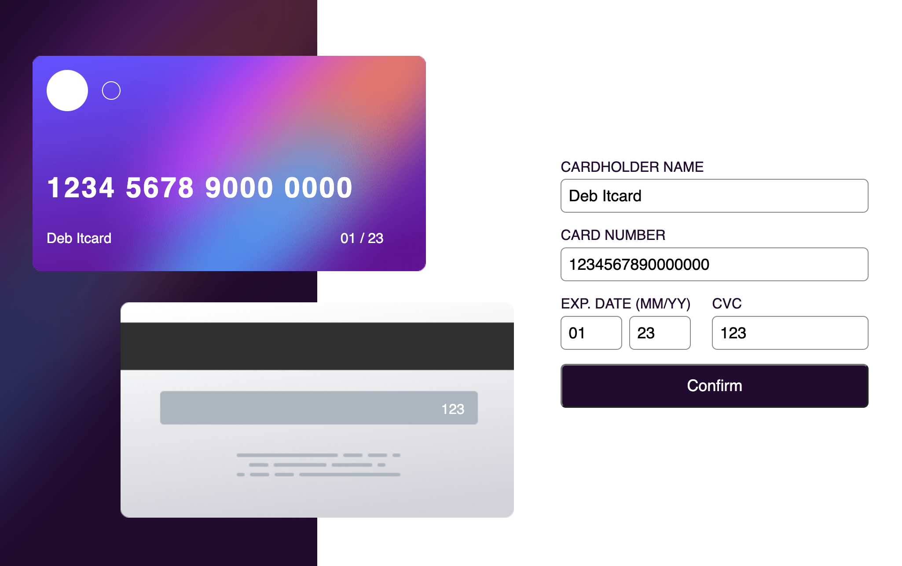
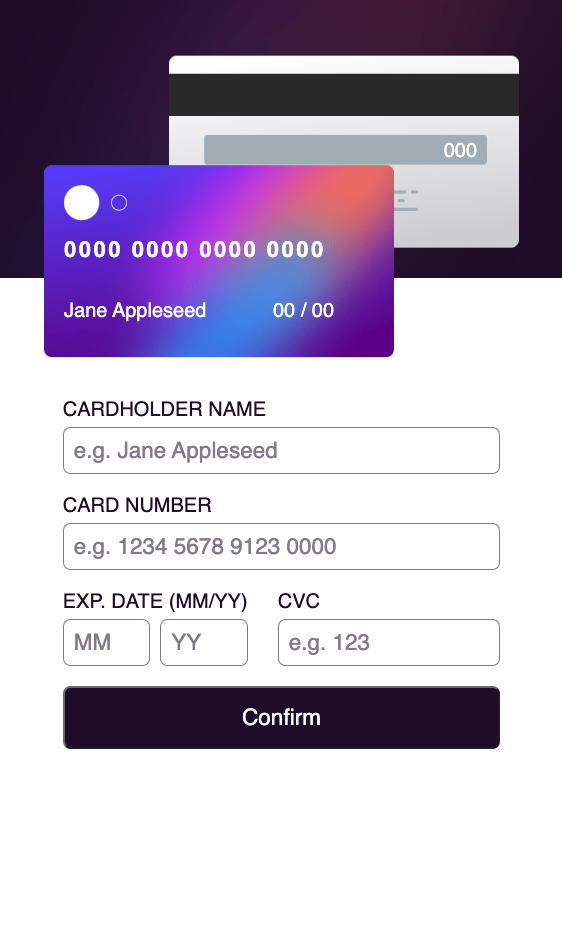

# Interactive Card Details Form

## A chic card details component challenge, from www.frontendmentor.com

This responsive credit card information component was designed according to UX specs on www.frontendmentor.com.

This one was a lot of fun, as it's a component that feels both fun to engage with and highly useful. Payment information pages can be rather dreary, so it was highly satisfying to build something that could keep a pleasurable UX design flowing right through the shopping process.

### New discoveries

I had to dive into some regex to make the credit card number appear properly, which was a rabbithole I haven't explored before, but is definitely one I'm going to explore more in times to come.

### Technologies

HTML5
Vanilla CSS3
JavaScript

### Current goals moving forward:

* Refactor into a React component for ease of reuse.
* Smoothen transition as screen narrows.
* Build out a simple back end to send an email.